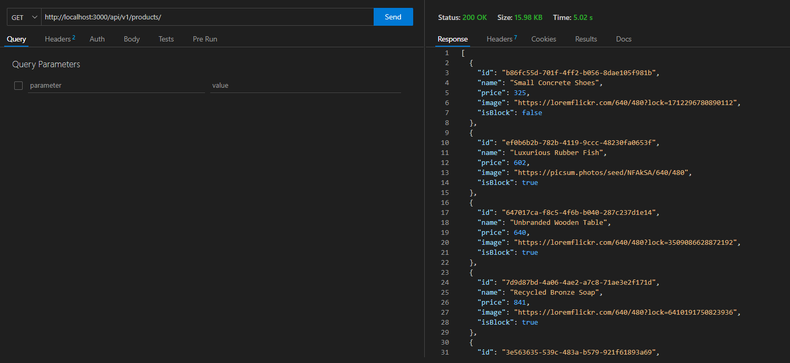
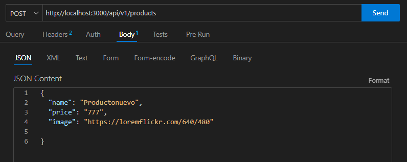
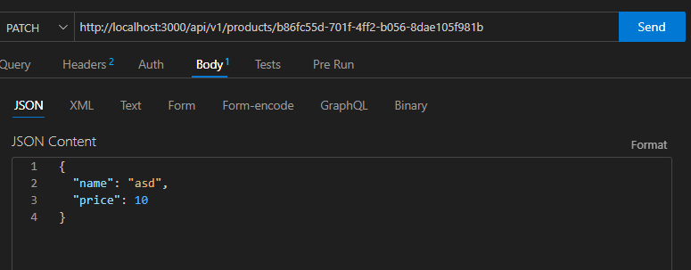
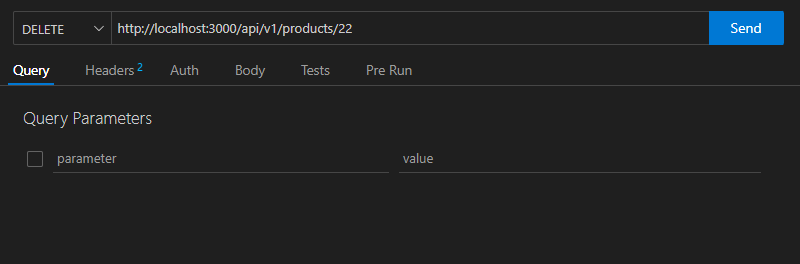

el api esta desplegado en: https://apinodestore-production.up.railway.app/

contiene las siguientes fuciones 

get https://apinodestore-production.up.railway.app/api/v1/products/ esto genera 100 objetos aleatiorios con los que se podra trabajar 

get https://apinodestore-production.up.railway.app/api/v1/products/(aqui el id) solamente un id

post https://apinodestore-production.up.railway.app/api/v1/products

la estructura de actualizacion debe ser 
{
  "name": "Productonuevo",
  "price": "777",
  "image": "https://loremflickr.com/640/480"
  
}

 

actualizar solamente alguos parametros de uno de los objetos generados

https://apinodestore-production.up.railway.app/(aqui el id)

 

borrar parametros por id https://apinodestore-production.up.railway.app/api/v1/products/(aqui el id)

